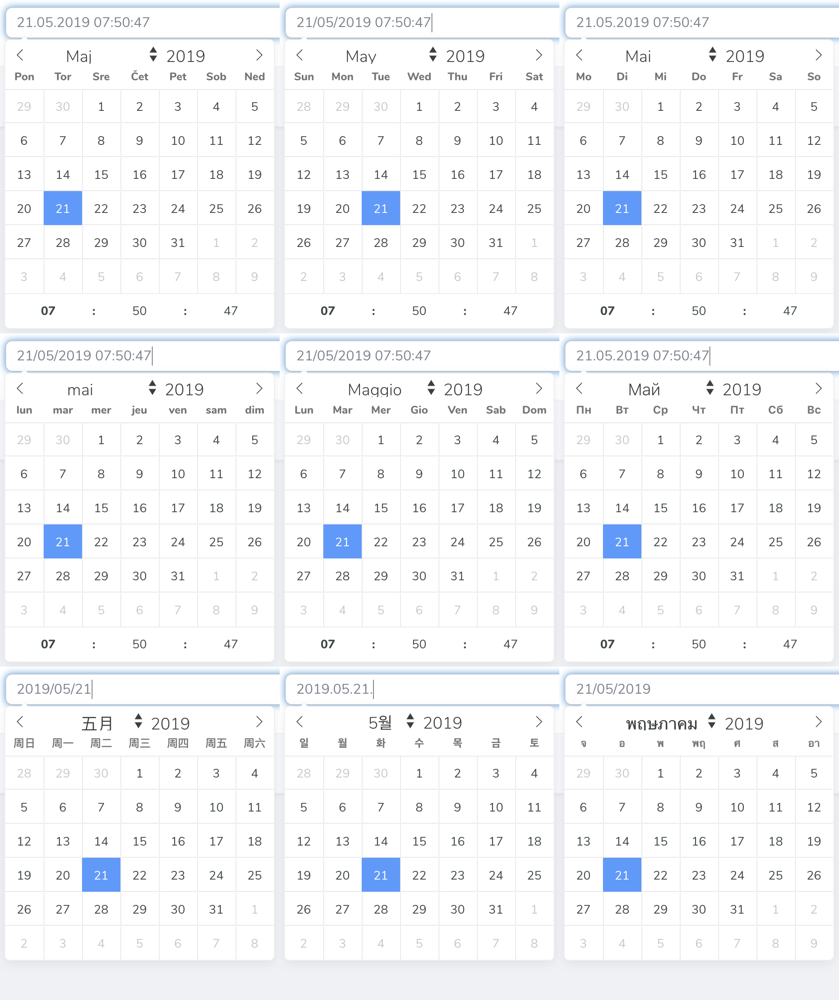

# International DateTime

[](https://packagist.org/packages/techouse/intl-date-time)
[](https://packagist.org/packages/techouse/intl-date-time)
[](https://packagist.org/packages/techouse/intl-date-time)
[](https://packagist.org/packages/techouse/intl-date-time)
[](https://www.codacy.com/manual/techouse/intl-date-time?utm_source=github.com&amp;utm_medium=referral&amp;utm_content=techouse/intl-date-time&amp;utm_campaign=Badge_Grade)
[](https://github.com/techouse/intl-date-time/stargazers)


##### International datepicker for Laravel Nova

Apply localisation in __71__ different locales to Laravel Nova's default `DateTime` field that currently doesn't support localisation out of the box.



## Installation

You can install the package in to a Laravel app that uses [Nova](https://nova.laravel.com) via composer:

```bash
composer require techouse/intl-date-time
```

## Usage

The API is adapted from [Nova's default `DateTime` Field](https://nova.laravel.com/docs/1.0/resources/fields.html#datetime-field).

The module itself offers a few optional configurations:
* __locale__ - _OPTIONAL_ -  Set the module's locale. If you do not it will automatically use your app's `config('app.locale')`. If you manually define an unsupported locale it will throw an Exception!
* __dateFormat__ - _OPTIONAL_ - Set a date format. If you do not provide it the module will automatically use the appropriate locale's date format. The format must be [MomentJS compatible](https://momentjs.com/docs/#/displaying/format/)!
* __timeFormat__ - _OPTIONAL_ - Set a time format. The format must be [MomentJS compatible](https://momentjs.com/docs/#/displaying/format/)! If you manually define an unsupported time format it will throw an Exception!
* __minDate__ - _OPTIONAL_ - Set a minimum/earliest date (inclusively) allowed for selection. Has to be an instance of `\DateTime` or `Carbon\Carbon`. Defaults to `null`.
* __maxDate__ - _OPTIONAL_ - Set a maximum/latest date (inclusively) allowed for selection. Has to be an instance of `\DateTime` or `Carbon\Carbon`. Defaults to `null`.
* __placeholder__ - _OPTIONAL_ - Set a placeholder. If you do not want a placeholder set it to `false`.
* __errorMessage__ - _OPTIONAL_ - Set a custom error message in case of an invalid date format. If you do not set it it will display an error message in the current locale.
* __errorMessageLocale__ - _OPTIONAL_ - Set a custom error message locale. If not set it equals the set `locale` or your app's `config('app.locale')`. If you manually define an unsupported locale it will throw an Exception! [Here is the list of all supported locales](https://github.com/baianat/vee-validate/tree/master/locale).
* __hideUserTimeZone__ - _OPTIONAL_ - When applied hides the user time zone next to the form field. Default is `false`.
* __withShortcutButtons__ - _OPTIONAL_ - When applied shows the user 3 shortcut buttons for 'yesterday, 'today' and 'tomorrow' below the calendar. The buttons are all in English and in order to translate them please edit your language JSON file in the directory `resources/lang/vendor/nova`.
* __withTime__ - _OPTIONAL_ - Shortcut for displaying the full locale time, e.g. HH:mm:ss. NOTE: The timeFormat option has precedence over withTime.
* __withTimeShort__ - _OPTIONAL_ - Shortcut for displaying the short locale time, e.g. HH:mm. NOTE: The timeFormat option has precedence over withTimeShort.
* __userTimeZone__ - _OPTIONAL_ - Define custom Timezone for specific field - by default Nova.config.userTimezone is used.

Simply use `IntlDateTime` class instead of `DateTime` directly or alias it like the example below so you won't have to refactor too much existing code.

```php
<?php

namespace App\Nova;

use Carbon\Carbon;
use Illuminate\Http\Request;
use Techouse\IntlDateTime\IntlDateTime as DateTime;

class User extends Resource
{
    /**
     *  This is how you use and configure this module
     */
    public function fields(Request $request)
    {
        return [
            DateTime::make(__('Updated at'), 'updated_at')
                    /**
                     * The module automatically uses your app's locale 
                     * from config('app.locale'), however you can manually
                     * override this by setting it like this.
                     * 
                     * IMPORTANT: Check the list of supported locales below in this readme!
                     * 
                     * NOTE: If the automatic locale is not supported by MomentJS 
                     * the module defaults to 'en-gb' (British English).
                     */
                    ->locale('sl'),
                    
            DateTime::make(__('Created at'), 'created_at')
                    /**
                      * You can optionally set a custom DATE format.
                      * 
                      * It has to be compatible with MomentJS!!!
                      * https://momentjs.com/docs/#/displaying/format/
                      */
                    ->dateFormat('DD.MM.YYYY'),   
                    
            DateTime::make(__('Deleted at'), 'deleted_at')
                    /**
                      * You can optionally set a custom TIME format
                      * 
                      * It has to be compatible with MomentJS!!!
                      * https://momentjs.com/docs/#/displaying/format/
                      */
                    ->timeFormat('HH:mm:ss'),
                    
            DateTime::make(__('Packaged on'), 'packaged_on')
                    /**
                      * You can optionally set a placeholder, otherwise
                      * it will default to your timezone's date format 
                      */
                    ->placeholder('DD.MM.LLLL'),
                    
            DateTime::make(__('Shipped on'), 'shipped_on')
                    /**
                      * You can disable the placeholder by setting it to false
                      */
                    ->placeholder(false),
                    
            DateTime::make(__('Birthday'), 'birthday')
                    /**
                      * You can override the default date invalid error message
                      */
                    ->errorMessage("I don't think you were born on that day mate :D"),
                    
            DateTime::make(__('Day of graduation'), 'graduated_on')
                    /**
                      * Unless you override the error message locale it equals the locale setting
                      */
                    ->errorMessageLocale('de'),
                    
            DateTime::make(__('Takes place at'), 'takes_place_at')
                    /**
                     * Set a minimum/earliest date (inclusively) allowed for selection.
                     */
                    ->minDate(Carbon::parse('1990-05-30'))
                    /**
                     * Set a maximum/latest date (inclusively) allowed for selection.
                     */
                    ->maxDate(Carbon::today()),
            
            DateTime::make(__('Day you got married'), 'day_you_got_married')
                    /**
                     * Hide the user time zone next to the form input field.
                     */
                    ->hideUserTimeZone(),

            DateTime::make(__('Date of travel'), 'date_of_travel')
                    /**
                     * Display shortcut buttons for "yesterday", "today" and "tomorrow".
                     * Translate them in your language's JSON file located in resources/lang/vendor/nova.
                     */
                    ->withShortcutButtons(),

            DateTime::make(__('Time of arrival'), 'time_of_arrival')
                    /**
                     * Shortcut for displaying the full locale time, e.g. HH:mm:ss.
                     * 
                     * NOTE: The timeFormat option has precedence over withTime.
                     */
                    ->withTime(),

            DateTime::make(__('Time of reservation'), 'time_of_reservation')
                    /**
                     * Shortcut for displaying the short locale time, e.g. HH:mm.
                     * 
                     * NOTE: The timeFormat option has precedence over withTimeShort.
                     */
                    ->withTimeShort(),

            DateTime::make(__('Time of reservation'), 'deleted_at')
                    /**
                     * Set default hour of time selector
                     */
                    ->defaultHour(9),

            DateTime::make(__('Time of reservation'), 'uploaded_at')
                    /**
                     * Set default minute of time selector
                     */
                    ->defaultMinute(30),
        ];
    }

    /**
     * The rest of the Resource ... bla bla bla :)
     */
}

```

## Programmed filling

Like many Laravel Nova Fields, this field implement the programmed filling. You can emit a Laravel Nova javascript event in order to fill the field in the update form.

```js
Nova.$emit('my-field-name-value', '29/06/1998')
```

Please make sure that the value emitted correspond to your local date.

## List of supported locales

This module supports only locales that are __SUPPORTED BY BOTH__ [MomentJS](https://github.com/moment/moment/tree/2.24.0/src/locale) __AND__ [Flatpickr](https://github.com/flatpickr/flatpickr/tree/v4.6.1/src/l10n)!

The __71__ locales that are _currently supported_ are:

| Language                      | locale    |
| :---                          | :---:     |
| Albanian                      | `sq`      |
| Arabic                        | `ar`      |
| Azerbaijani                   | `az`      |
| Bangla                        | `bn`      |
| Belarusian                    | `be`      |
| Bosnian                       | `bs`      |
| Bulgarian                     | `bg`      |
| Burmese                       | `my`      |
| Catalan                       | `ca`      |
| Chinese (China)               | `zh-cn`   |
| Chinese (Hong Kong)           | `zh-hk`   |
| Chinese (Taiwan)              | `zh-tw`   |
| Croatian                      | `hr`      | 
| Czech                         | `cs`      |
| Danish                        | `da`      |
| Dutch                         | `nl`      |
| English                       | `en`      |
| English (Australia)           | `en-au`   |
| English (Canada)              | `en-ca`   |
| English (Ireland)             | `en-ie`   |
| English (New Zealand)         | `en-nz`   |
| English (United Kingdom)      | `en-gb`   |
| Esperanto                     | `eo`      |
| Estonian                      | `et`      |
| Faroese                       | `fo`      |
| Finnish                       | `fi`      |
| French                        | `fr`      |
| French (Canada)               | `fr-ca`   |
| French (Switzerland)          | `fr-ch`   |
| Georgian                      | `ka`      |
| German                        | `de`      |
| German (Austria)              | `de-at`   |
| German (Switzerland)          | `de-ch`   |
| Greek                         | `el`      |
| Hebrew                        | `he`      |
| Hindi                         | `hi`      |
| Hungarian                     | `hu`      |
| Indonesian                    | `id`      |
| Icelandic                     | `is`      |
| Irish Gaelic                  | `ga`      |
| Italian                       | `it`      |
| Japanese                      | `ja`      |
| Kazakh                        | `kk`      |
| Khmer                         | `km`      |
| Korean                        | `ko`      |
| Latvian                       | `lv`      |
| Lithuanian                    | `lt`      |
| Macedonian                    | `mk`      |
| Malaysian                     | `ms`      |
| Mongolian                     | `mn`      |
| Norwegian                     | `nb`      |
| Persian                       | `fa`      |
| Polish                        | `pl`      |
| Portuguese                    | `pt`      |
| Portuguese (Brazil)           | `pt-br`   |
| Punjabi                       | `pa-in`   |
| Romanian                      | `ro`      |
| Russian                       | `ru`      |
| Serbian                       | `sr`      |
| Serbian (Cyrillic)            | `sr-cyrl` |
| Sinhala                       | `si`      |
| Slovak                        | `sk`      |
| Slovenian                     | `sl`      |
| Spanish                       | `es`      |
| Spanish (Dominican Republic)  | `es-do`   |
| Spanish (United States)       | `es-us`   |
| Swedish                       | `sv`      |
| Thai                          | `th`      |
| Turkish                       | `tr`      |
| Ukrainian                     | `uk`      |
| Vietnamese                    | `vi`      |
| Welsh                         | `cy`      |

##### NOTE
This an evolution of my original [Slovenian DateTime](https://github.com/techouse/slovenian-date-time)
